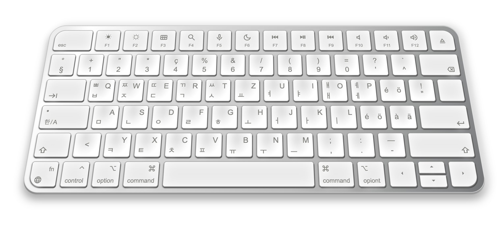

# Korean (한글) German Keyboard - Pure HTML and CSS implementation

Korean German Keyboards is a simple HTML and CSS project that showcases Korean and German keyboard layouts without using any images. This provides a realistic visual representation of keyboard layouts for both Korean and German languages, allowing users to understand and familiarize themselves with the arrangement of characters and symbols on the keyboard.

## Features:
- Pure HTML and CSS implementation, no images.
- Interactive visual representation of Korean and German keyboard layouts.
- Only click visual effect with no additional feature to input text like a virtual keyboard.

## Contributing:
Contributions to enhance the project, add new features or practice a Pull Request are welcome!

## License:
This project is licensed under the MIT License. See the LICENSE file for details.

Enjoy exploring Techxxxy's Keyboard!
